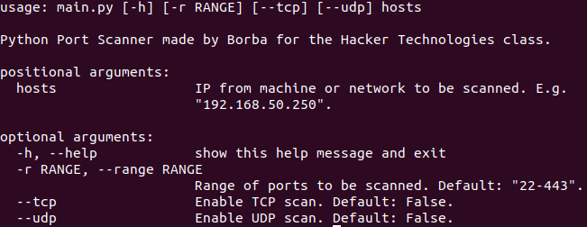
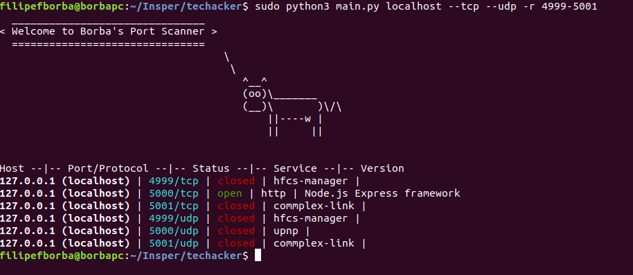

# SimplePortScanner
A simple nmap Port Scanner built with Python.

## Requirements

The only required depedency for this project is the [nmap library](https://pypi.org/project/python-nmap/), which can be installed via pip.  
We have a ```requirements.txt``` file as well. Simply use ```sudo pip3 install --requirement requirements.txt```.

## How to Use

In order to use this port scanner, simply follow the instructions from the help section.

  

An example input is: ```sudo python3 main.py localhost --tcp --udp -r 0-1000```  
This will scan the 'localhost' host's ports 0 to 1000 with TCP and UDP scan enabled.

## Example output

  
